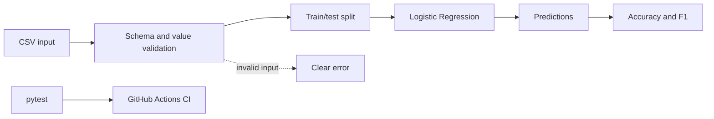

# AI-01 Production ML Classifier

An **AI/ML + production engineering** learning project. It contains a small,
testable classification pipeline and the repository practices needed to evolve
it safely.

## Problem

The project classifies two-feature records into one of two labels. The first
iteration is intentionally small: its purpose is to establish a reproducible
baseline for data validation, model training, testing, and CI before adding
more realistic data or deployment concerns.

## Approach

The baseline uses Logistic Regression from scikit-learn. The pipeline reads a
CSV file, validates its required columns and values, splits the data with a
fixed random seed, trains the model, and reports Accuracy and F1.

The sample dataset is synthetic and is included only as a deterministic fixture
for local development and CI.

## Setup

Requirements: Python 3.11+.

```bash
python -m venv .venv
source .venv/bin/activate
python -m pip install -r requirements.txt
```

## Run

Run the complete baseline with one command:

```bash
python src/train.py --data data/sample.csv
```

Expected output for the included fixture:

```text
Accuracy: 1.000
F1: 1.000
```

Example input (`data/sample.csv`):

```csv
feature_a,feature_b,label
1.0,1.1,0
4.0,4.1,1
```

The real fixture contains enough rows for a stratified train/test split. Empty
files, missing columns, missing values, and single-class data produce clear
validation errors.

## Test

```bash
python -m pytest -q
```

CI runs the same tests and baseline command on every push and pull request.

## Architecture



## Repository Structure

```text
src/                         Source and model code
tests/                       Unit and regression tests
data/                        Small, safe development fixtures
docs/                        Measurements and engineering notes
.github/workflows/           Continuous integration
.github/ISSUE_TEMPLATE/      Standard issue intake
```

## Metrics and Baseline

| Metric | Current fixture result | Interpretation |
| --- | ---: | --- |
| Accuracy | 1.000 | Correct predictions / test examples |
| F1 | 1.000 | Harmonic mean of precision and recall |

These values are not a production performance claim. The fixture is tiny,
synthetic, and deliberately easy to separate.

## Limitations and Risks

- The sample dataset does not represent real-world distribution or drift.
- A single train/test split is insufficient for model selection.
- No model artifact, serving API, monitoring, or data versioning exists yet.
- Accuracy and F1 can hide class-specific failures; future work should include
  a confusion matrix and per-class metrics.

## Security and Cost Notes

- Do not commit secrets, credentials, personal data, or `.env` files.
- Only synthetic fixture data belongs in this repository.
- The baseline runs locally and uses no external API, cloud service, or paid
  compute; current runtime cost is effectively zero apart from local resources.
- Future production work must add access control, data retention rules, and a
  cost budget before using external infrastructure.

## Status

Week 1: Repository scaffold, baseline classifier, tests, CI, and documentation.
