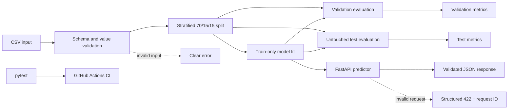

# AI-01 Production ML Classifier

An **AI/ML + production engineering** learning project. It contains a small,
testable classification pipeline and the repository practices needed to evolve
it safely.

## Problem

The project classifies breast mass measurements as malignant or benign using a
small, reproducible subset of the real Breast Cancer Wisconsin (Diagnostic)
dataset. It exists to establish a baseline for data validation, model training,
testing, and CI; it is a learning project, not a medical diagnostic tool.

## Approach

The baseline uses Logistic Regression from scikit-learn. The pipeline reads a
CSV file, validates its required columns and values, creates stratified
train/validation/test partitions with a fixed random seed, fits a class-balanced
model on train only, and reports separate validation and test metrics. A second
command compares Logistic Regression, Decision Tree, and Random Forest using
malignant-class precision, recall, F1, and ROC-AUC without selecting on test.
The selected baseline is also exposed through a typed FastAPI endpoint with
request IDs, structured validation failures, and a non-root Docker image.

The default dataset contains the mean radius and mean texture features. Its
provenance, transformations, appropriate use, and risks are recorded in the
[data card](docs/data-card.md); its dataset license is in
[`data/LICENSE.md`](data/LICENSE.md). The synthetic sample remains only as a
small deterministic test fixture.

## Quickstart from a Fresh Clone

Requirements: Python 3.11+.

```bash
git clone https://github.com/aemref/AI-01-production-ml-classifier.git
cd AI-01-production-ml-classifier
python -m venv .venv
source .venv/bin/activate
python -m pip install -r requirements.txt
python src/train.py
```

The last command trains and evaluates the baseline against the repository's
licensed real-data subset. No API key, external service, or data download is
required.

Compare the three fixed baseline candidates:

```bash
python -m src.compare_models
```

Candidates are fitted on train only. Models meeting the provisional malignant
precision floor are ranked on validation; only the selected model is then
evaluated once on test. See the [comparison report](docs/week-03-model-comparison.md)
and [model-card draft](docs/model-card.md).

## Serve Predictions

Start the API locally after installing the runtime dependencies:

```bash
python -m uvicorn src.api:app --host 127.0.0.1 --port 8000
```

Then check readiness and request one prediction:

```bash
curl http://127.0.0.1:8000/health
curl -X POST http://127.0.0.1:8000/predict \
  -H 'Content-Type: application/json' \
  -d '{"feature_a":17.99,"feature_b":10.38}'
```

Responses include the binary label, human-readable label, both class
probabilities, confidence, and a dataset-derived model version. This educational
endpoint is not a medical device and must not be used for diagnosis or treatment.

Build and run the non-root container:

```bash
docker build -t ai01-classifier .
docker run --rm -p 8000:8000 ai01-classifier
```

Measure the in-process HTTP path with fixed request and warmup counts:

```bash
python -m src.benchmark_api --requests 200 --warmup 20
```

The measured baseline, methodology, failure taxonomy, and limitations are in the
[production inference report](docs/week-04-production-inference.md).

## Run

Run the complete baseline with one command:

```bash
python src/train.py
```

Expected output for the default real-data subset:

```text
Validation accuracy: 0.918
Validation F1: 0.933
Validation malignant recall: 0.906
Test accuracy: 0.860
Test F1: 0.882
Test malignant recall: 0.906
```

Input schema:

```csv
feature_a,feature_b,label
17.99,10.38,0
13.54,14.36,1
```

Here `feature_a` is mean radius, `feature_b` is mean texture, and labels `0` and
`1` mean malignant and benign respectively. Empty files, missing columns,
missing or non-finite values, non-numeric features, invalid labels, and data too
small for a stratified split produce clear validation errors. Training also
stops before splitting when a feature directly or inversely copies the binary
target, or when duplicate feature rows could cross partition boundaries.

## Test

```bash
python -m pip install -r requirements-dev.txt
python -m pytest -q
```

CI runs the same tests, baseline command, and data-quality audit on every push
and pull request.

## Data Quality Audit

Run the reproducible missingness, class-imbalance, and leakage-risk checks:

```bash
python src/data_quality.py
```

The current dataset has no missing values or duplicate feature rows. Its class
ratio is `1.684` (357 benign to 212 malignant), classified by the audit's
temporary heuristic as moderate imbalance. Neither feature copies the target,
and neither crosses the audit's temporary absolute-correlation threshold of
`0.95`. See the [risk analysis](docs/week-02-data-quality-risks.md) for findings,
limitations, and follow-up work.

The English [EDA notebook](notebooks/week-02-eda.ipynb) and its concise
[evaluation report](docs/week-02-eda-report.md) compare the original and
class-balanced baselines, including their error trade-off. The notebook is
committed with its outputs so the reported row counts, distributions, quality
signals, and model comparison can be inspected without rerunning it.

## Architecture



## Repository Structure

```text
src/                         Source and model code
tests/                       Unit and regression tests
data/                        Small, safe development fixtures
docs/                        Measurements and engineering notes
notebooks/                   Reproducible English EDA notebooks
.github/workflows/           Continuous integration
.github/ISSUE_TEMPLATE/      Standard issue intake
```

## Metrics and Baseline

| Metric | Validation | Test |
| --- | ---: | ---: |
| Accuracy | 0.918 | 0.860 |
| Benign F1 | 0.933 | 0.882 |
| Malignant recall | 0.906 | 0.906 |

These deterministic values use only two of the source dataset's 30 features and
one 70/15/15 split. They are not a production or clinical performance claim.

## Limitations and Risks

- This historical dataset does not establish present-day clinical validity or
  represent deployment populations and drift.
- The baseline uses only mean radius and mean texture, discarding 28 source
  features for a deliberately small first integration.
- A single train/test split is insufficient for model selection.
- The API retrains a deterministic small model at startup; no signed, persisted
  model artifact or rollback mechanism exists yet.
- The endpoint has request correlation and rejection logs, but no authentication,
  rate limiting, distributed tracing, or drift monitoring.
- A single malignant-recall metric still cannot replace a confusion matrix,
  uncertainty analysis, subgroup evaluation, or clinical validation.

## Security and Cost Notes

- Do not commit secrets, credentials, personal data, or `.env` files.
- Only reviewed, licensed, non-identifying data and synthetic fixtures belong
  in this repository.
- The baseline runs locally and uses no external API, cloud service, or paid
  compute; current runtime cost is effectively zero apart from local resources.
- Future production work must add access control, data retention rules, and a
  cost budget before using external infrastructure.

## Status

Week 4 in progress: typed inference API, reusable predictor, structured failure
telemetry, non-root Docker image, API benchmark, and CI container smoke test.
