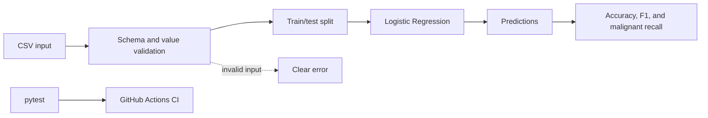

# AI-01 Production ML Classifier

An **AI/ML + production engineering** learning project. It contains a small,
testable classification pipeline and the repository practices needed to evolve
it safely.

## Problem

The project classifies breast mass measurements as malignant or benign using a
small, reproducible subset of the real Breast Cancer Wisconsin (Diagnostic)
dataset. It exists to establish a baseline for data validation, model training,
testing, and CI; it is a learning project, not a medical diagnostic tool.

## Approach

The baseline uses Logistic Regression from scikit-learn. The pipeline reads a
CSV file, validates its required columns and values, splits the data with a
fixed random seed, trains a class-balanced model, and reports Accuracy, benign
F1, and malignant recall.

The default dataset contains the mean radius and mean texture features. Its
provenance, transformations, appropriate use, and risks are recorded in the
[data card](docs/data-card.md); its dataset license is in
[`data/LICENSE.md`](data/LICENSE.md). The synthetic sample remains only as a
small deterministic test fixture.

## Setup

Requirements: Python 3.11+.

```bash
python -m venv .venv
source .venv/bin/activate
python -m pip install -r requirements.txt
```

## Run

Run the complete baseline with one command:

```bash
python src/train.py
```

Expected output for the included fixture:

```text
Accuracy: 0.888
F1: 0.908
Malignant recall: 0.906
```

Input schema:

```csv
feature_a,feature_b,label
17.99,10.38,0
13.54,14.36,1
```

Here `feature_a` is mean radius, `feature_b` is mean texture, and labels `0` and
`1` mean malignant and benign respectively. Empty files, missing columns,
missing or non-finite values, non-numeric features, invalid labels, and data too
small for a stratified split produce clear validation errors.

## Test

```bash
python -m pytest -q
```

CI runs the same tests, baseline command, and data-quality audit on every push
and pull request.

## Data Quality Audit

Run the reproducible missingness, class-imbalance, and leakage-risk checks:

```bash
python src/data_quality.py
```

The current dataset has no missing values or duplicate feature rows. Its class
ratio is `1.684` (357 benign to 212 malignant), classified by the audit's
temporary heuristic as moderate imbalance. Neither feature copies the target,
and neither crosses the audit's temporary absolute-correlation threshold of
`0.95`. See the [risk analysis](docs/week-02-data-quality-risks.md) for findings,
limitations, and follow-up work.

The English [EDA notebook](notebooks/week-02-eda.ipynb) and its concise
[evaluation report](docs/week-02-eda-report.md) compare the original and
class-balanced baselines, including their error trade-off.

## Architecture



## Repository Structure

```text
src/                         Source and model code
tests/                       Unit and regression tests
data/                        Small, safe development fixtures
docs/                        Measurements and engineering notes
notebooks/                   Reproducible English EDA notebooks
.github/workflows/           Continuous integration
.github/ISSUE_TEMPLATE/      Standard issue intake
```

## Metrics and Baseline

| Metric | Current fixture result | Interpretation |
| --- | ---: | --- |
| Accuracy | 0.888 | Correct predictions / test examples |
| F1 | 0.908 | Harmonic mean of precision and recall for label `1` (benign) |
| Malignant recall | 0.906 | Share of malignant test rows correctly detected |

These deterministic values use only two of the source dataset's 30 features and
one train/test split. They are not a production or clinical performance claim.

## Limitations and Risks

- This historical dataset does not establish present-day clinical validity or
  represent deployment populations and drift.
- The baseline uses only mean radius and mean texture, discarding 28 source
  features for a deliberately small first integration.
- A single train/test split is insufficient for model selection.
- No model artifact, serving API, monitoring, or data versioning exists yet.
- A single malignant-recall metric still cannot replace a confusion matrix,
  uncertainty analysis, subgroup evaluation, or clinical validation.

## Security and Cost Notes

- Do not commit secrets, credentials, personal data, or `.env` files.
- Only reviewed, licensed, non-identifying data and synthetic fixtures belong
  in this repository.
- The baseline runs locally and uses no external API, cloud service, or paid
  compute; current runtime cost is effectively zero apart from local resources.
- Future production work must add access control, data retention rules, and a
  cost budget before using external infrastructure.

## Status

Week 2: Real classification data, dataset licensing, data card, stronger input
validation, tests, and CI integration.
