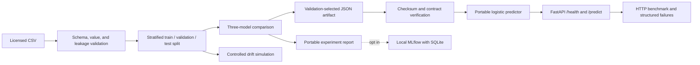

# Architecture

## System boundary

AI-01 is a local, single-model reference service. It validates a licensed CSV,
selects a baseline on a validation partition, publishes a checksummed JSON model
artifact, and serves predictions through FastAPI. It has no remote data source,
hosted model, credential, background worker, or paid cloud dependency.

The test partition is not used for candidate selection. The checked-in API
artifact is fitted on the train partition, carries the complete dataset digest,
and is loaded only after its sidecar checksum and schema contract pass.

## Runtime path

1. Uvicorn starts `src.api:app`.
2. The FastAPI lifespan loads the artifact through `Predictor.from_artifact`.
3. Integrity, schema, feature order, label order, dataset identity, and numeric
   model parameters are validated before the service accepts traffic.
4. Pydantic rejects missing, unknown, non-numeric, or non-finite request fields.
5. The portable predictor standardizes both features and computes logistic
   probabilities without loading scikit-learn model objects.
6. Responses expose the label, both probabilities, confidence, and artifact
   version. Validation failures expose a request ID but never log the payload.

## Trust and failure boundaries

| Boundary | Fail-closed behavior | Remaining limitation |
| --- | --- | --- |
| Input dataset | Reject invalid schema, values, labels, target copies, and duplicate feature rows | Structural checks cannot prove causal or collection-time leakage |
| Model artifact | Reject missing sidecar, checksum mismatch, incompatible schema, or dataset mismatch | The checksum is not a signature against a repository writer |
| HTTP request | Return structured `422` and a correlation ID | No authentication or rate limiting |
| Benchmark | Count failures by category and exit nonzero | Local results do not establish production capacity |
| Drift study | Compare paired predictions under a fixed synthetic shift | Not real monitoring or evidence of clinical drift |

## Deployment and rollback

The Docker image contains runtime dependencies, source, data, and the published
artifact; it runs as the unprivileged `app` user. CI builds the image, waits for
health, exercises one prediction, and runs a bounded external HTTP benchmark.
Rollback is a normal reviewed commit that points to a previously verified
artifact, followed by the same full release gates. History is never rewritten.

## Deliberate exclusions

This educational repository is not a medical device and does not claim clinical
validity. Authentication, authorization, encryption termination, signed model
provenance, persistent observability, real drift monitoring, subgroup analysis,
and stakeholder-approved operating thresholds are required before any real
deployment decision.
